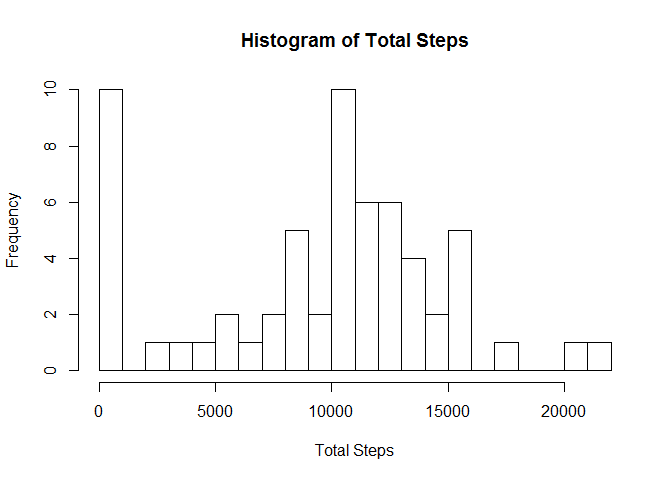
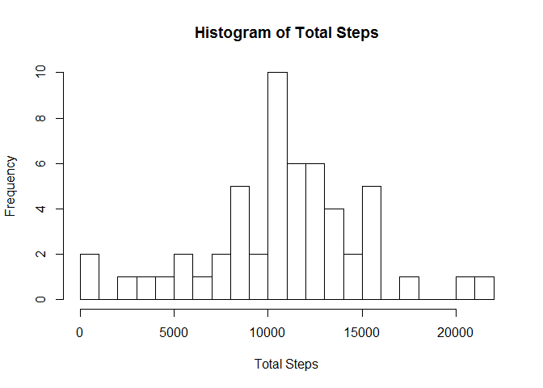
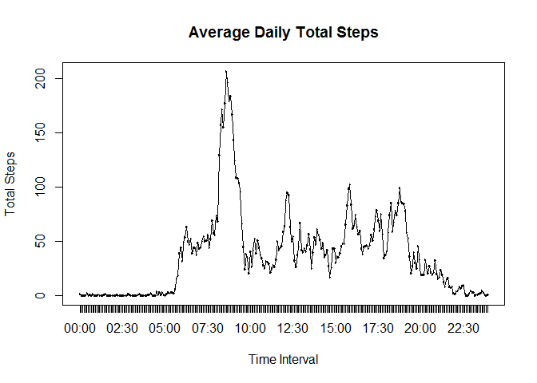
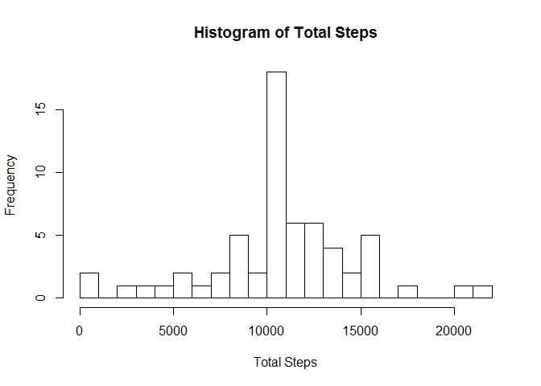
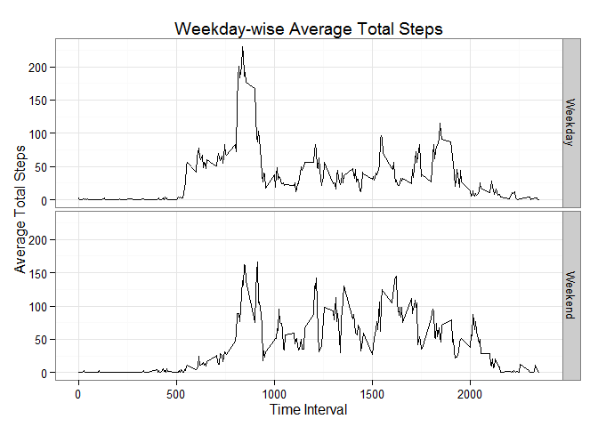

# Reproducible Research: Peer Assessment 1


## Loading and preprocessing the data


```r
ANAL <- read.csv("activity.csv", header = TRUE)
ANAL$date = as.Date(ANAL$date)
```


## What is mean total number of steps taken per day?

### After removing NAs from the data

#### Calculate the total number of steps taken per day

```r
TOT_STEPS_NONA <- group_by(ANAL,date) %>% summarise(Total.Steps = sum(steps, na.rm = TRUE))
```
#### Make a histogram of the total number of steps taken each day


```r
hist(TOT_STEPS_NONA$Total.Steps, breaks = 20, xlab = "Total Steps", main = "Histogram of Total Steps")
```

 


#### Calculate and report the mean and median of the total number of steps taken per day

<b><u>The mean of total number of steps taken per day: 9354.2295</u></b>

<b><u>The median of total number of steps taken per day: 10395.0000</u></b>

###  Without removing NAs

#### Calculate the total number of steps taken per day


```r
TOT_STEPS_NA <- group_by(ANAL,date) %>% summarise(Total.Steps = sum(steps))
```

#### Make a histogram of the total number of steps taken each day


```r
hist(TOT_STEPS_NA$Total.Steps, breaks = 20, xlab = "Total Steps", main = "Histogram of Total Steps")
```

 


#### Calculate and report the mean and median of the total number of steps taken per day

<b><u>The mean of total number of steps taken per day: 10766.1887</u></b

<br>

<b><u>The median of total number of steps taken per day: 10765.0000</u></b>


## What is the average daily activity pattern?

### Make a time series plot (i.e. type = "l") of the 5-minute interval (x-axis) and the average number of steps taken, averaged across all days (y-axis)	


```r
NEW_SUMMRY <- group_by(ANAL, interval) %>% summarise(Mean.Steps = mean(steps, na.rm = TRUE))
NEW_SUMMRY$Intervals <- factor(strftime(strptime(sprintf("%04d",NEW_SUMMRY$interval), "%H%M"), "%H:%M"))
with(NEW_SUMMRY, {plot(Intervals, Mean.Steps, main = "Average Daily Total Steps", xlab = "Time Interval", ylab = "Total Steps")
  lines(Intervals, Mean.Steps)})
```

 

### Which 5-minute interval, on average across all the days in the dataset, contains the maximum number of steps?


```r
NEW_SUMMRY[NEW_SUMMRY$Mean.Steps == max(NEW_SUMMRY$Mean.Steps),]	
```

```
## Source: local data frame [1 x 3]
## 
##   interval Mean.Steps Intervals
##      (int)      (dbl)    (fctr)
## 1      835   206.1698     08:35
```

<b><u>The 5-minute interval that contains the maximum number of steps(on average across all the days in the dataset) is: 08:35</u></b>
  
  
## Imputing missing values

### Calculate and report the total number of missing values in the dataset (i.e. the total number of rows with NAs)


```r
dim(ANAL[is.na(ANAL$steps),])[1] #2304 rows have missing values
```

```
## [1] 2304
```

<b><u>total number of missing values in the dataset (i.e. the total number of rows with NAs): 2304</u></b>

### Devise a strategy for filling in all of the missing values in the dataset. The strategy does not need to be sophisticated. For example, you could use the mean/median for that day, or the mean for that 5-minute interval, etc.
#### <b><u>The strategy is, for every interval with NA steps, assign corresponding the mean of all the other days on which the interval has non-NA steps. The idea is that the activity at a particular time of the day, on an average, remains the same</u></b>

### Create a new dataset that is equal to the original dataset but with the missing data filled in.


```r
mergeddf <- merge (ANAL, NEW_SUMMRY, by.x = "interval")
mergeddf[is.na(mergeddf$steps),]$steps = mergeddf[is.na(mergeddf$steps),]$Mean.Steps
```

### Make a histogram of the total number of steps taken each day and Calculate and report the mean and median total number of steps taken per day. Do these values differ from the estimates from the first part of the assignment? What is the impact of imputing missing data on the estimates of the total daily number of steps?


```r
mergeddf_summ <- group_by(mergeddf,date) %>% summarise(Total.Steps = sum(steps, na.rm = TRUE))
hist(mergeddf_summ$Total.Steps, breaks = 20, xlab = "Total Steps",  main = "Histogram of Total Steps")
```

 


<b><u>The mean of total number of steps taken per day: 10766.1887</u></b

<br>

<b><u>The median of total number of steps taken per day: 10766.1887</u></b>


```r
x <- c(mean(TOT_STEPS_NONA$Total.Steps, na.rm = TRUE), median(TOT_STEPS_NONA$Total.Steps, na.rm = TRUE))
y <- c(mean(TOT_STEPS_NA$Total.Steps, na.rm = TRUE), median(TOT_STEPS_NA$Total.Steps, na.rm = TRUE))
z <- c(mean(mergeddf_summ$Total.Steps, na.rm = TRUE), median(mergeddf_summ$Total.Steps, na.rm = TRUE))

all_tab <- cbind(x,y,z)
colnames(all_tab) <- c("Total Steps Calculated With NA", "Total Steps Calculated Without NA", "Total Steps Calculated After Imputing")
rownames(all_tab) <- c("Mean", "Median")
xt <- xtable(all_tab)
print(xt, type = "html")
```

<!-- html table generated in R 3.1.3 by xtable 1.7-4 package -->
<!-- Fri Nov 13 21:24:37 2015 -->
<table border=1>
<tr> <th>  </th> <th> Total Steps Calculated With NA </th> <th> Total Steps Calculated Without NA </th> <th> Total Steps Calculated After Imputing </th>  </tr>
  <tr> <td align="right"> Mean </td> <td align="right"> 9354.23 </td> <td align="right"> 10766.19 </td> <td align="right"> 10766.19 </td> </tr>
  <tr> <td align="right"> Median </td> <td align="right"> 10395.00 </td> <td align="right"> 10765.00 </td> <td align="right"> 10766.19 </td> </tr>
   </table>


####<b><u>As can be seen from the table above when the total steps were calculated with NAs(sum(...,na.rm=FALSE), there is major difference between the mean & media total steps and mean & media total steps after imputing NAs. However there is hardly any difference between mean and median calculated after removing NAs and after imputing NAs</u></b>


## Are there differences in activity patterns between weekdays and weekends?

### Create a new factor variable in the dataset with two levels - "weekday" and "weekend" indicating whether a given date is a weekday or weekend day.


```r
wkdys <- c("Monday","Friday","Tuesday","Thursday","Wednesday")
wknddys <- c("Sunday","Saturday")
mergeddf$Weekday <- weekdays(mergeddf$date)
mergeddf$WKDY <- ifelse(mergeddf$Weekday %in% wkdys, "Weekday", ifelse(mergeddf$Weekday  %in% wknddys, "Weekend", NA))
```

### Make a panel plot containing a time series plot (i.e. type = "l") of the 5-minute interval (x-axis) and the average number of steps taken, averaged across all weekday days or weekend days (y-axis). See the README file in the GitHub repository to see an example of what this plot should look like using simulated data.


```r
mergeddf_sum1  <- group_by(mergeddf, interval, Intervals, WKDY) %>% summarise(Average.Steps = mean(steps))

gp <- ggplot(mergeddf_sum1, aes(interval, Average.Steps), ymax = max(mergeddf_sum1$Average.Steps), ymin = min(mergeddf_sum1$Average.Steps))
gp <- gp + geom_line()+theme_bw()
gp <- gp + facet_grid(WKDY~.)
gp <- gp + ggtitle("Weekday-wise Average Total Steps")+ylab("Average Total Steps")+xlab("Time Interval")

print(gp)
```

 
